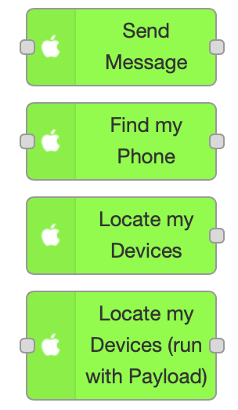
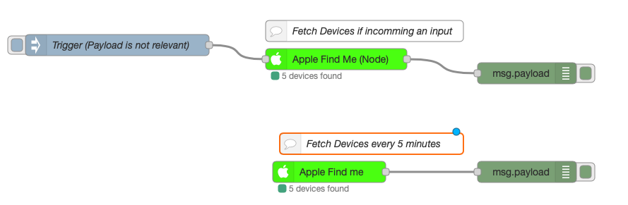

[](https://github.com/PfisterDaniel/node-red-apple-find-me/releases/latest)


# [node-red](https://github.com/PfisterDaniel/node-red-apple-find-me.git)-apple-find-me node
This is a node-red node to get the current locations and other metrics of connected Apple devices.

It work's without 2-Factor-Authentication (2FA) and retrive all connected devices include family devices.


## Installation
[](https://npmjs.org/package/node-red-apple-find-me)

Install from your Node-RED Manage Palette

or

Install using npm

    $ npm install node-red-apple-find-me

Redmatic:

    $ source /usr/local/addons/redmatic/home/.profile
    $ /usr/local/addons/redmatic/var
    $ npm install --save --no-package-lock --global-style --save-prefix="~" --production node-red-apple-find-me


## Nodes:


## Examples:



#### Parameter (Account):
| Parameter | Description |
| ------ | ------ |
| Name | Node Name |
| Apple ID | self explanatory |
| Password | self explanatory |
| Show Family-Entries | Shows devices of the family (true / false) |


#### Parameter (Locate my Devices):
| Parameter | Description |
| ------ | ------ |
| Account | Your Apple Account |
| Name | Node Name |
| Geo-API | OpenStreetMaps, HereMaps or GoogleMaps (HereMaps and GoogleMaps needs an API-KEY) |
| Trigger Interval | How often should the devices be updated |
| Places | Define locations that should be specified in the payload if the device is within a 150 meter radius |

#### Parameter (Locate my Devices with Payload):
| Parameter | Description |
| ------ | ------ |
| Account | Your Apple Account |
| Name | Node Name |
| Geo-API | OpenStreetMaps, HereMaps or GoogleMaps (HereMaps and GoogleMaps needs an API-KEY) |
| Places | Define locations that should be specified in the payload if the device is within a 150 meter radius |

#### Parameter (Send Message):
| Parameter | Description |
| ------ | ------ |
| Account | Your Apple Account |
| Name | Node Name |
| Device-ID | ID of the iOS-Device (You can get it with the Locate my Devices Node) |


#### Parameter (Find my Phone):
| Parameter | Description |
| ------ | ------ |
| Account | Your Apple Account |
| Name | Node Name |
| Device-ID | ID of the iOS-Device (You can get it with the Locate my Devices Node) |

## How to use
  * Add **Locate my Devices** node or a **Locate my Devices (run with Payload)** node to your flow
  * Create Account-Information
  * Setting Properties and enjoy


## Features
  * Define places
  * Retriev device metrics (ModelName, ModelImage, DeviceID, DisplayName, BatteryLevel, BatteryState)
  * Retriev location information (Latitude, Longitude, CurrentPlace, CurrentAddress, OSM-Url, GoogleMaps-Url)
  * Run Find my iPhone
  * Send Message to an iOS Device
  * Add new node within you can locate your devices by incoming an input


## Example Payload (Locate my Devices):
```yaml
{
       "<ModelType> e.g: MacBook Pro or iPhone":[
          {
             "modelName":"<ModelName> e.g: MacBook Pro 13\"",
             "modelImageLink_Small":"<ModelImageSmallLink>",
             "modelImageLink_Medium":"<ModelImageMediumLink>",
             "modelImageLink_Large":"<ModelImageLargeLink>",
             "deviceID":"<Unique DeviceID>",
             "displayName":"<DiviceName> e.g: Daniel's MacBook Pro",
             "batteryLevel":"<BatteryLevel in percent> e.g 53",
             "batteryState":"<BatteryStatus> e.g: CHARGING",
             "locationInfo":{
                "altitude":0,
                "latitude":0.00000000000,
                "longitude":0.00000000000,
                "isInaccurate":false,
                "isOld":false,
                "positionType":"Wifi or GPS",
                "horizontalAccuracy":"<Accuracy in meters> e.g: 65,
                "verticalAccuracy":0,
                "currentPlace":"<if device in place then its here the name of place when distance < 150 meters>",
                "currentAddress":{<Address-Object from OpenStreetMap, HereMap or GoogleMaps>},
                "osmUrl":"<OpenStreetMaps Url>",
                "googleUrl":"<GoogleMaps Url>",
                "locationTimeStamp":"<TimeStamp of last location> e.g: 2020-11-10 14:51:12"
             },
             "refreshTimeStamp":"<RefreshTimeStamp> e.g: 2020-11-10 14:54:22"
          }
       ]
    }
 }
 ```


## Changelog
| Version | Description |
| ------ | ----------- |
| 1.0.0 | Initial Version |
| 1.0.1 | Add BatteryStatus |
| 1.0.2 | Nodes now available through the Node-Red palette |
| 1.0.3 | Bug with Places solved |
| 1.0.4 | Added Find my iPhone and send message, Geolocation GoogleMaps |
| 1.0.5 | Added new Node (apple-find-me-with-payload), API-Key now a Password-Fields |
|       | Added Descriptions, |

## Bugs and feature requests
Please create an issue in [GitHub](https://github.com/PfisterDaniel/node-red-apple-find-me/issues)